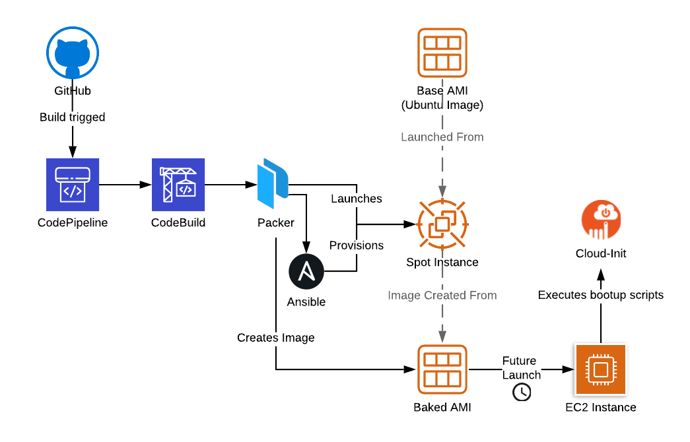
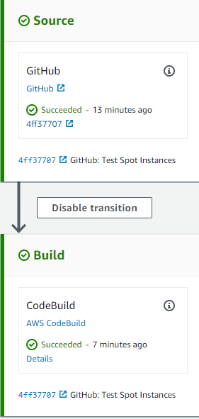
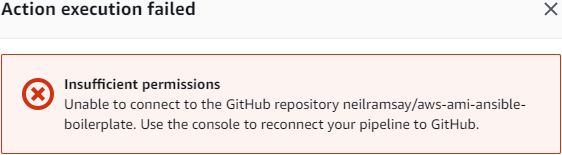
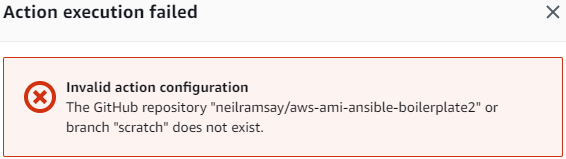
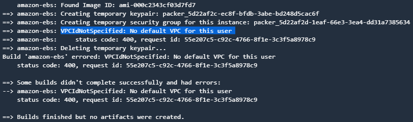

AWS AMI Baking Boilerplate
==========================

Demonstrates an automated AMI baking process to build a "[boilerplate](https://en.wikipedia.org/wiki/Boilerplate_code)" AMI, using Ansible.

---
## Shortcut

I recommend you read the below sections, but if you can't wait, here is the _how_, without the _what_ and _why_.

1. Create a GitHub Personal access token, with the permissions
    - `repo`
    - `admin:repo_hook`
2. Create the CloudFormation Stacks
    - [pipeline-common](cloudformation/pipeline-common.yml)
    - [ami-common](cloudformation/ami-common.yml)
    - [pipeline.yml](cloudformation/pipeline.yml)
3. Check CodePipeline console for build to complete

> If it goes badly, the relevant comics are here:
> - [Compromise](https://www.monkeyuser.com/2018/compromise/)
> - [Implementation](https://www.monkeyuser.com/2018/implementation/)

---
## FAQ
### What are AMIs?
Amazon Machine Images (AMIs) provide the starting point for new Elastic Compute Cloud (EC2) Instances.
Public AMIs are often copies of disks (called snapshots) after a base operating system has been installed, such as Windows, Red Hat Linux, and Ubuntu Linux.
When a new EC2 Instance is launched from an AMI, copies of the snapshots are created as new disks (called volumes), and are then specific to that Instance moving forward.

### What is AMI Baking?
AMI Baking is the process of taking raw ingredients, mixing them in to an EC2 instance, and then "baking" a new AMI for future use.
Baking is typically done automatically with an automation "pipeline" process.

The raw ingredients can include:
- The Base Operating System AMI
- Recent security patches
- Additional application software

The [AWS AMI Design](https://aws.amazon.com/answers/configuration-management/aws-ami-design/) AWS Answer goes in to further detail on considerations needed for AMI Baking.

### Why AMI Bake?
- Reduced launch time - the launched EC2 instance has less work to get ready to serve it's purpose.
    + Common "agents", such as for centralised logging, monitoring can be preinstalled.
    + Workload specific application software can be preinstalled, and only runtime configuration be required.
- Reproducible - the instructions to create the AMI are described in code, and therefore repeatable without human-error. This code can then be stored in a source version control to show changes over time.
- Consistent
    + EC2 instances launched from the same AMI will have the same software versions. Manually built systems may have different software versions over time.
    + The same AMI can be used across all environments (Non-Production, Production, and DR)
- Testable - the produced AMI can be run through various testing tools to ensure any launched EC2 Instances pass compliance requirements.

---
## Baking Process

The above is an automated AMI Baking Process, utilising:
- GitHub for Source Version Control
- CodePipeline to orchestrate the fetching of code, and delivery to CodeBuild
- CodeBuild to fetch and execute Packer/Ansible
    + [Packer](https://packer.io/) creates launches temporary EC2 Instances that Ansible can customise, and then bake.
    + [Ansible](https://www.ansible.com/) is a configuration management tool to customise the Base AMI, as described in [Ansible Playbooks](https://docs.ansible.com/ansible/latest/user_guide/playbooks_intro.html)

---
## Usage
### Step One: GitHub to CodePipeline Authorisation
CodePipeline needs to be able to access the GitHub source repository, and be notified of changes.
To facilitate this, an authorisation token (OAuth) is needed.

For GitHub, a [personal access token needs to be created](https://help.github.com/en/articles/creating-a-personal-access-token-for-the-command-line), with the following permissions:
- `repo`
- `admin:repo_hook`

This will allow CodePipeline to read private repositories, and register itself for change notifications (webhooks).

### Step Two: Deploy CloudFormation Templates
There are three CloudFormation templates that will deploy everything needed to create multiple AMI Baking CodePipelines.

> [pipeline-common](cloudformation/pipeline-common.yml); IAM ManagedPolicies and Roles that can be used by different CodePipelines, and an S3 Artifact Bucket used by CodePipeline to store artifacts consumed and produced in each stage of the pipeline. _This is intended to create one CloudFormation Stack per AWS Account only._
> - Inputs: None.

> [ami-common](cloudformation/ami-common.yml); creates IAM ManagedPolicies and Roles specific to CodeBuild creating AMIs. The IAM policy mostly comes from the [Packer AMI Builder documentation](https://www.packer.io/docs/builders/amazon.html#iam-task-or-instance-role). _This is intended to create one CloudFormation Stack per AWS Account only._
> - Inputs
>   + The CloudFormation `pipeline-common` Stack Name, so it can include the correct authorisation to the S3 Artifact Bucket

> [pipeline](cloudformation/pipeline.yml); creates a CodePipeline Instance, with integrations to GitHub, and CodeBuild Project. Each CloudFormation Stack will reference a different GitHub Source Repository.
> - Inputs:
>    + The CloudFormation `pipeline-common` Stack Name
>    + The CloudFormation `ami-common` Stack Name
>    + The GitHub Source Repository, in `user/repo` format
>    + The Git Branch of the GitHub Source Repository, usually `master`
>    + The previously create OAuth token to grant CodePipeline access to GitHub

### Step Three: Check Build
In the CodePipeline console, locate the CodePipeline and check it's status. CodePipeline should have fetched the latest code from GitHub, and CodeBuild should either be in progress, or complete.

If this doesn't work, visit the [Troubleshooting](#Troubleshooting) section.

---
## Customising the Boilerplate
This boilerplate currently builds only one AMI, and has a simplified [Ansible Playbook](https://docs.ansible.com/ansible/latest/user_guide/playbooks_intro.html), which assumes the use of Ubuntu.

The first customisation is to change the name from `boiler` to your own project.
You'll need:
1. Duplicate and modify `packer/boiler.json` ([Packer Template](https://www.packer.io/docs/templates/index.html))
    - Update the `variables` section
    - Update the `ansible_playbook` variable to your new project name
    - Update tagging to match your requirements (`run_tags`, `run_volume_tags`, and `tags`)
    - Have a good read through the rest, using the [Packer `amazon-ebs` Builder Documentation](https://www.packer.io/docs/builders/amazon-ebs.html) as reference
1. Update the `packer/ubuntu-source.json` Packer Variable File to use a more recent version of Ubuntu, if your workload supports it
1. Modify `buildspec.yml` ([CodeBuild Build Specification](https://docs.aws.amazon.com/codebuild/latest/userguide/build-spec-ref.html))
    - Replace references to `packer/boiler.json` with your own Packer Template
1. Duplicate and modify `ansible/boiler.yaml` to your own project name.
1. Create [Ansible Roles](https://docs.ansible.com/ansible/latest/user_guide/playbooks_reuse_roles.html) for each specific AMI customisation step. For example, we already have the installation of a Simple Network Management Protocol (SNMP) agent, and deployment of a Linux user (with SSH key). If you're new to Ansible, start with the [Intro to Playbooks](https://docs.ansible.com/ansible/latest/user_guide/playbooks_intro.html) Ansible Documentation page.

### Spot Instance Temporary Instance
It is possible for Packer to launch the EC2 instance as a Spot Instance.
This reduces the EC2 compute cost significantly, with the downside that builds may fail if there is insufficient capacity in your region (either at or during build).
Baking AMIs is not a critical task, and therefore loss of a temporary EC2 Instance is acceptable.

This has been used in the past, however is a little unreliable at this
stage due to needing to have workable IAM Service-Linked Roles.

The `features/neilramsay/spot` branch of this repository includes the relevant Packer instructions, and IAM configuration to enable Spot Instance builds.

---
## Troubleshooting
### Problem: GitHub Insufficient permissions

* Check the OAuth Token has been correctly copied in to the `pipeline` CloudFormation Stack.

### Problem: GitHub Repository Does Not Exist

* Check the GitHub repository exists
* Check the GitHub repository has the named branch
* Check the GitHub Personal Access Token (OAuth) is authorised for both `repo` and `admin:repo_hook`.

### Problem: CodeBuild/Packer - No Default VPC

Packer by default uses the "Default VPC" to perform builds, and assumes it will be present.
If you have deleted your Default VPC, you'll need to explicitly tell Packer which VPC to use, and ensure CodeBuild can connect to the launched temporary EC2 Instance.

See the `vpc_id` and `subnet_id` settings in the Packer [`amazon-ebs` builder](https://www.packer.io/docs/builders/amazon-ebs.html).
Add the relevant configuration to the [packer/boiler.json](packer/boiler.json) file.
